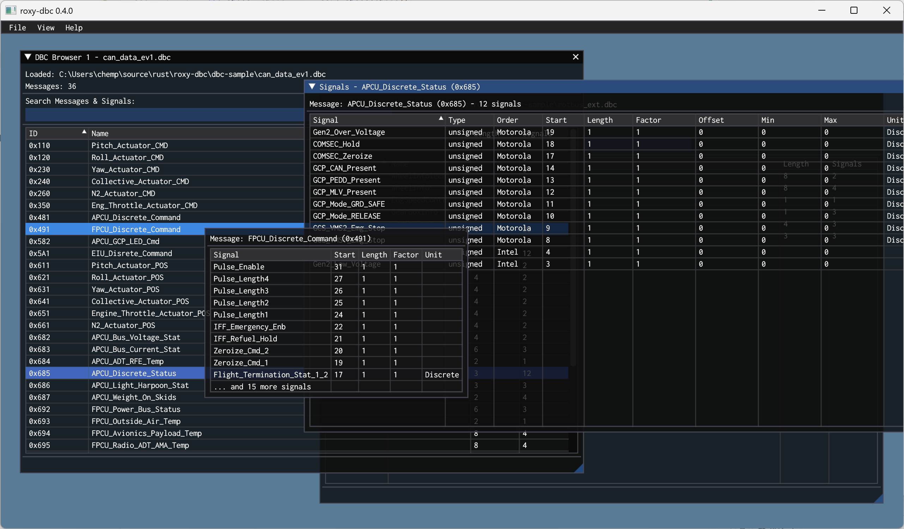

# Roxy DBC

[](https://www.rust-lang.org)
[](LICENSE)

一个现代化的 CAN 数据库编辑器，使用 Rust 和 ImGui 构建。支持 DBC 编辑、ARXML/KCD 导入导出、信号位布局可视化。

## ✨ 特性

- 🚗 **DBC 完整支持** - 打开、编辑、保存 CAN 数据库文件
- 🇨🇳 **中文支持** - 中文注释 / 值表显示与编辑，自动识别 UTF-8 / GBK 编码并按原编码保存
- ⚡ **CAN FD** - 标准/扩展、经典/CAN FD 四种帧格式，DLC 最大 64 字节，`VFrameFormat` 属性读写
- 📋 **All Signals / 通信矩阵** - 全信号展平视图（DBC messages 窗口入口），任意列排序过滤，值表行内编辑，导出 CSV
- 📄 **多格式支持** - 导入 ARXML / KCD，导出 AUTOSAR ARXML
- 🖱️ **拖放打开** - 直接把 DBC/ARXML/KCD 文件拖进窗口即可打开
- ✏️ **消息与信号编辑** - 全部属性可编辑（含消息 ID），含值表（VAL_）编辑
- 🧩 **节点（ECU）管理** - 添加 / 删除 / 重命名网络节点，重命名自动同步收发引用
- 🗂️ **信号位布局图** - 可视化信号占位，支持 Intel/Motorola 字节序
- 🎯 **多选批处理** - Ctrl/Shift 多选，批量复制 / 剪切 / 删除
- 📊 **多窗口 + Docking** - 同时打开多个文件，窗口自由停靠
- 🔍 **搜索与排序** - 消息过滤、按任意列排序
- ↩️ **撤销/重做** - 所有操作支持 Undo/Redo，批量操作合并为单步撤销
- ✅ **DBC 校验** - Tools > Validate 检查错误与警告（DLC、位越界、命名、引用等）
- ⚡ **高性能** - wgpu 硬件加速渲染

## 🖼️ 界面预览



## ⌨️ 快捷键

| 快捷键 | 功能 |
| --- | --- |
| Ctrl+N | 新建 DBC |
| Ctrl+O | 打开文件 |
| Ctrl+S | 保存（新文件弹出另存为对话框） |
| Ctrl+Z / Ctrl+Y | 撤销 / 重做 |
| Ctrl+C / X / V | 复制 / 剪切 / 粘贴消息 |
| Del | 删除选中的消息（弹出确认） |
| Enter | 打开选中消息的信号窗口 |
| Shift+点击 / 方向键 | 范围多选 |

## 📝 编辑功能

### 消息
可编辑 Message ID（十六进制/十进制输入，带范围与重复校验）、名称、大小、帧格式（Standard/Extended × 经典/CAN FD）、发送节点、注释。通过右键菜单、Edit 菜单或 "+ Add Message" 按钮新建消息。

### 信号
可编辑名称、起始位、长度、字节序（Intel/Motorola）、符号类型、系数、偏移、最小/最大值、单位、注释和接收节点。信号窗口中的 "+ Add Signal" 按钮可快速新建。

### 值表（VAL_）
- 非法整数和重复值实时提示
- 应用时自动按值排序
- 支持从剪贴板批量导入（如 `0 "Off" 1 "On"`）

### 编辑模式
所有编辑对话框使用三按钮模式：
- **OK** - 保存并关闭
- **Cancel** - 放弃修改并关闭
- **Apply** - 保存但保持打开，支持持续编辑

## 🔀 导入 / 导出

- **导入**: ARXML（CAN-FRAME / I-SIGNAL-I-PDU）和 KCD 文件，File > Import 或直接拖放
- **导出**: AUTOSAR 4.x 风格 ARXML（File > Export ARXML...），包含 CAN-FRAME、CAN-FRAME-TRIGGERING、I-SIGNAL-I-PDU

## 🗺️ 位布局图

打开消息窗口即可看到信号位布局：按字节行显示每个信号的占位，颜色区分不同信号，选中的信号高亮描边。支持 Intel（小端，位号线性递增）与 Motorola（大端，字节内递减后折行至下一字节）两种位序。

## 🛠️ 技术栈

- **语言**: Rust 2024 Edition
- **GUI**: [dear-imgui-rs](https://github.com/Latias94/dear-imgui-rs) 0.18（Dear ImGui 1.92.9b docking）+ wgpu
- **窗口管理**: winit
- **DBC 解析**: can-dbc
- **XML 解析**: roxmltree
- **文件对话框**: rfd

## 📦 安装

### 下载
从 [Releases](https://github.com/chemPolonium/roxy-dbc/releases) 下载最新版本的 `roxy-dbc.exe`（Windows）。

### 命令行
```bash
roxy-dbc.exe                          # 空启动
roxy-dbc.exe path\to\file.dbc        # 启动时打开文件
roxy-dbc.exe a.dbc b.arxml c.kcd     # 同时打开多个文件
```
支持 `.dbc` / `.arxml` / `.kcd`，也可在资源管理器中通过"打开方式"关联到 roxy-dbc。

### 从源码构建
```bash
git clone https://github.com/chemPolonium/roxy-dbc.git
cd roxy-dbc
cargo build --release
cargo run --release
```

## 📁 项目结构

```
src/
├── main.rs              # 程序入口，事件循环与拖放处理
├── lib.rs               # 库入口（供集成测试使用）
├── app.rs               # 窗口和图形上下文管理
├── win_clipboard.rs     # Win32 系统剪贴板后端
├── editable_dbc.rs      # 数据模型、编辑操作、CAN FD 与 Undo/Redo
├── import/              # 导入
│   ├── arxml.rs         # ARXML 解析
│   └── kcd.rs           # KCD 解析
├── export/              # 导出
│   └── arxml.rs         # ARXML 生成
└── ui/                  # UI 模块
    ├── state.rs         # UI 状态、剪贴板、对话框状态
    ├── dbc_window.rs    # DBC 浏览器（消息表格）
    ├── all_signals_window.rs  # All Signals / 通信矩阵（全信号展平 + Values 行内编辑 + CSV 导出）
    ├── message_window.rs    # 消息详情窗口（信号表格 + 位布局图）
    ├── message_edit_window.rs   # 消息编辑对话框（含 ID / CAN FD 编辑）
    ├── signal_edit_window.rs    # 信号编辑对话框（含值表编辑）
    ├── node_window.rs   # 节点管理对话框
    ├── bit_layout.rs    # 信号位布局渲染
    └── menu.rs          # 菜单栏和快捷键
```

## 🔮 未来计划

- [ ] 位布局图交互式编辑（拖拽调整信号位置）
- [ ] 网络拓扑图
- [ ] 实时 CAN 数据监控

## 📄 许可证

本项目基于 GPLv3 许可证开源 - 查看 [LICENSE](LICENSE) 文件了解详情。

## 📝 更新日志

查看 [CHANGELOG.md](CHANGELOG.md) 了解详细的版本历史和更新内容。

## 🙏 致谢

- [can-dbc](https://github.com/marcelbuesing/can-dbc) - DBC 文件解析库
- [Dear ImGui](https://github.com/ocornut/imgui) - 即时模式 GUI 库
- [imgui-rs](https://github.com/imgui-rs/imgui-rs) - ImGui 的 Rust 绑定
- [wgpu](https://github.com/gfx-rs/wgpu) - 现代图形 API

## 🤝 贡献

欢迎提交 Issue 和 Pull Request！

## 💬 联系方式

- GitHub Issues: [https://github.com/chemPolonium/roxy-dbc/issues](https://github.com/chemPolonium/roxy-dbc/issues)
