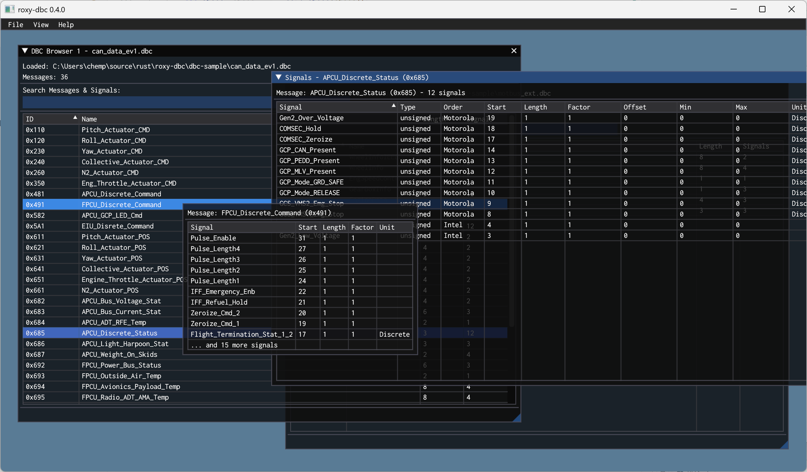

# Roxy DBC

[](https://www.rust-lang.org)
[](LICENSE)

一个现代化的 CAN / FlexRay 数据库编辑器，使用 Rust 和 dear-imgui 构建。支持 DBC 编辑（含 `BA_` 属性）、FIBEX XML / AUTOSAR ARXML (FlexRay) 查看与编辑、KCD 与 Excel 通信矩阵导入、信号位布局可视化。

## ✨ 特性

- 🚗 **DBC 完整支持** - 打开、编辑、保存 CAN 数据库文件
- 🚋 **FIBEX / ARXML (FlexRay)** - 打开、查看、编辑 FIBEX 3.0 与 AUTOSAR R4.x 数据库：帧（每通道各一个时隙/周期/preamble）、PDU（含信号映射、收发节点、TP 与网络管理 PDU）、信号（含 COMPU-METHOD 因子/偏移/值表/上下限/单位）、ECU（含关键时隙号与用途）、集群参数（周期、宏节拍时长、一个周期的宏节拍数）；七个标签页含静态段**调度表**（周期 × 时隙矩阵，可点格子改排程，冲突时隙标红）、**通信矩阵**（帧 × ECU 的 TX/RX）与信号清单 CSV 导出；保存回 FIBEX / ARXML 保持内容不丢
- 🇨🇳 **中文支持** - 中文注释 / 值表显示与编辑，自动识别 UTF-8 / GBK 编码并按原编码保存
- ⚡ **CAN FD** - 标准/扩展、经典/CAN FD 四种帧格式，DLC 最大 64 字节，`VFrameFormat` 属性读写
- 📋 **All Signals / 通信矩阵** - 全信号展平视图（DBC messages 窗口入口），任意列排序过滤，值表行内编辑，导出 CSV
- 🖥️ **CANdb++ 风格标签页** - Messages & Signals / All Signals / Node List / Communication Matrix / Export
- 📄 **多格式支持** - 导入 ARXML / KCD / Excel 通信矩阵模板，导出 AUTOSAR ARXML 与 Excel 模板
- 🖱️ **拖放打开** - 直接把 DBC/ARXML/KCD/XLSX 文件拖进窗口即可打开
- ✏️ **消息与信号编辑** - 全部属性可编辑（含消息 ID），含值表（VAL_）编辑
- 🏷️ **DBC 属性** - `BA_DEF_` / `BA_` / `BA_DEF_DEF_` 读入、编辑、写回；枚举属性用下拉，Validate 检查取值是否越界或不在枚举列表
- 🖥️ **命令行改 DBC** - 不开窗口就能加注释、增删改消息与信号、写属性、校验，结果打到 stdout、错误打到 stderr，退出码固定，给脚本和 AI 代理用
- 🧩 **节点（ECU）管理** - 添加 / 删除 / 重命名网络节点，重命名自动同步收发引用
- 🗂️ **信号位布局图** - 可视化信号占位，支持 Intel/Motorola 字节序
- 🎯 **多选批处理** - Ctrl/Shift 多选，批量复制 / 剪切 / 删除
- 📊 **多窗口 + Docking** - 同时打开多个文件，窗口自由停靠
- 🔍 **搜索与排序** - 消息过滤、按任意列排序
- ↩️ **撤销/重做** - 所有操作支持 Undo/Redo，批量操作合并为单步撤销
- ✅ **数据库校验** - Tools > Validate 按焦点检查当前 DBC 或 FIBEX 文件（DLC、位越界、命名、引用、时隙冲突等），错误与警告分列
- ⚡ **高性能** - wgpu 硬件加速渲染

## 🖼️ 界面预览



## ⌨️ 快捷键

| 快捷键 | 功能 |
| --- | --- |
| Ctrl+N | 新建 DBC |
| Ctrl+Shift+N | 新建 FlexRay 数据库（FIBEX） |
| Ctrl+O | 打开文件 |
| Ctrl+S | 保存（新文件弹出另存为对话框） |
| Ctrl+Shift+S | 另存为 |
| Ctrl+Z / Ctrl+Y | 撤销 / 重做 |
| Ctrl+C / X / V | 复制 / 剪切 / 粘贴消息 |
| Del | 删除选中的消息（弹出确认） |
| Enter | 打开选中消息的信号窗口 |
| Shift+点击 / 方向键 | 范围多选 |

## 📝 编辑功能

### 消息
可编辑 Message ID（十六进制/十进制输入，带范围与重复校验）、名称、大小、帧格式（Standard/Extended × 经典/CAN FD）、发送节点、注释。通过右键菜单、Edit 菜单或 "+ Add Message" 按钮新建消息。

### 信号
可编辑名称、起始位、长度、字节序（Intel/Motorola）、符号类型、系数、偏移、最小/最大值、单位、注释和接收节点。信号窗口中的 "+ Add Signal" 按钮可快速新建。

### 值表（VAL_）
- 非法整数和重复值实时提示
- 应用时自动按值排序
- 支持从剪贴板批量导入（如 `0 "Off" 1 "On"`）

### 属性（BA_）
消息与信号的编辑窗口底部有一节 **Attributes**：文件里 `BA_DEF_` 声明了什么属性就列出什么，枚举属性给下拉（当前值不在列表里时会被追加进下拉，不会被改掉），其余给文本框，清空文本即删除该取值；给没声明过的属性赋值时自动补一条声明。`VFrameFormat` 不在这一节里，它由帧格式两个选项决定。

- Messages & Signals 表的 **Cycle** 列：周期时间按 `GenMsgCycleTime`、`CycleTime` 的优先顺序取文件里声明过的那个（含 `BA_DEF_DEF_` 的默认值），都没有时显示 `-`；点列标题可按周期排序
- 保存时写回 `BA_DEF_`（声明）、`BA_DEF_DEF_`（默认值）与 `BA_`（取值）
- Tools > Validate 报出取值超出声明的 INT/FLOAT 范围、或不在枚举列表里的属性
- 关系属性与环境变量属性不读也不写，保持原样

### 编辑模式
所有编辑对话框使用三按钮模式：
- **OK** - 保存并关闭
- **Cancel** - 放弃修改并关闭
- **Apply** - 保存但保持打开，支持持续编辑

## 🔀 导入 / 导出

- **导入**: ARXML（CAN-FRAME / I-SIGNAL-I-PDU）和 KCD 文件，File > Import as DBC...；Excel 通信矩阵模板，File > Import Excel Matrix...
- **导出**: AUTOSAR 4.x 风格 CAN ARXML 与通信矩阵 Excel（DBC 窗口的 Export 标签页）。CAN ARXML 含 CAN-CLUSTER（通道与帧触发：标识符、标准/扩展寻址、CAN FD 收发行为）、CAN-FRAME、I-SIGNAL-I-PDU、I-SIGNAL 与 COMPU-METHOD（因子/偏移、上下限、单位、值表、符号）、ECU-INSTANCE 与收发端口、帧与信号注释；导出的文件可直接用 Ctrl+O 再打开（按内容识别为 CAN 快照）
- DBC 属性（`BA_DEF_` / `BA_` / `BA_DEF_DEF_`）随文件一起读入、写回，见上文「属性（BA_）」一节；导出的 ARXML 不表达这些属性（ARXML 里没有对应位置）

### 📊 Excel 通信矩阵模板

模板就是 `dbc-sample/DbcDemo.xlsx` 那种单表 CanMatrix：第 1 行是中英双语表头，报文行与信号行混排，末尾几列的表头是节点名。

- **报文行**：报文名称非空，填 Msg_ID（十进制或 `0x` 十六进制）、Msg_Length、备注，节点列标 S 的是发送节点
- **信号行**：信号名称非空，归属它上面最近的报文行；起始位/长度/排列格式/数据类型/精度/偏移/上下限/单位/信号值描述逐列填写，节点列标 R 的接收该信号
- 报文行标的 R 节点会被它下面的信号行沿用，信号行自己标了 R 则以信号行为准
- ID 大于 `0x7FF` 判为扩展帧，长度大于 8 判为 CAN FD
- 空白模板：File > Export Excel Template...；把当前 DBC 写成模板：DBC 窗口 Export 标签页的 Export Excel...
- 报文类型、发送类型、周期时间、快速周期、重发次数、延时、信号发送类型、初始值、无效值、非使能值存为 DBC 属性（`GenMsgType` / `GenMsgSendType` / `GenMsgCycleTime` / `GenMsgCycleTimeFast` / `GenMsgNrOfRepetition` / `GenMsgDelayTime` / `GenSigSendType` / `GenSigStartValue` / `GenSigInvalidValue` / `GenSigInactiveValue`），初始值一类支持 `0x` 十六进制；导出模板时按同样的名字读回来
- 导入过程中被跳过的行（缺 Msg_ID、信号上面没有报文行）会在 Validation Results 窗口里按行号列出

## 🖥️ 命令行改 DBC

同一个 exe 不开窗口也能直接改文件，给脚本和 AI 代理用：

```bash
roxy-dbc.exe --help                          # 命令清单与选项
roxy-dbc.exe dbc show motor.dbc              # 节点、报文、信号、注释、属性、值表
roxy-dbc.exe dbc show motor.dbc --json       # 同一份内容，机器读的形式
roxy-dbc.exe dbc comment motor.dbc --message EngineData --text "发动机数据"
roxy-dbc.exe dbc comment motor.dbc --signal EngineData.EngSpeed --text "发动机转速"
roxy-dbc.exe dbc comment motor.dbc --message EngineData --clear
roxy-dbc.exe dbc message add motor.dbc --name BrakeData --id 0x1A --size 2 --transmitter ABS --text "制动数据"
roxy-dbc.exe dbc signal add motor.dbc --message BrakeData --name Pressure --start 0 --bits 12 --byte-order motorola --factor 0.5 --max 200 --unit bar --receivers ECU1 --values "0 idle 1 active"
roxy-dbc.exe dbc message set motor.dbc --message BrakeData --cycle 20 --size 4
roxy-dbc.exe dbc attribute set motor.dbc --signal BrakeData.Pressure --name GenSigStartValue --value 0
roxy-dbc.exe dbc node add motor.dbc --name ECU3
roxy-dbc.exe dbc validate motor.dbc
```

- 命令有 `show` `comment` `message add|set|delete` `signal add|set|delete` `attribute set` `node add|rename|delete` `validate`
- 帮助有这几种写法，都退出码 0：`roxy-dbc.exe --help` / `-h` / `/?`（列命令与退出码）、`roxy-dbc.exe dbc signal add --help`（列一条命令的选项）、`roxy-dbc.exe dbc help comment`（同上的另一种写法）
- 目标写名字或 ID 都认：`--message EngineData`、`--message 0x064`、`--signal EngineData.EngSpeed`；写错时会说明并列出文件里有什么
- 写回按打开时的编码（UTF-8 / UTF-8 BOM / GBK），先写同目录临时文件再替换，不会留下半个文件；`--out <路径>` 写副本不动原文件，`--backup` 先把原文件存成 `.bak`
- 值表按 `VAL_` 的写法给：`0 "Off" 1 "On"`，描述带不带引号都行；周期时间写到文件里已声明的那个属性上（`GenMsgCycleTime`，只有 `CycleTime` 时用它）
- 结果走 stdout，错误走 stderr；退出码 0 成功、1 `validate` 查出错误、2 命令没做成（选项不对、目标不存在、文件读写失败）
- 节点注释（`CM_ BU_`）、环境变量（`EV_`）、信号组（`SIG_GROUP_`）、独立值表（`VAL_TABLE_`）本工具不建模：改带这些段的文件时，写回前会在 stderr 说明这些行会丢

## 🗺️ 位布局图

打开消息窗口即可看到信号位布局：按字节行显示每个信号的占位，颜色区分不同信号，选中的信号高亮描边。支持 Intel（小端，位号线性递增）与 Motorola（大端，字节内递减后折行至下一字节）两种位序。

## 🛠️ 技术栈

- **语言**: Rust 2024 Edition
- **GUI**: [dear-imgui-rs](https://github.com/Latias94/dear-imgui-rs) 0.18（Dear ImGui 1.92.9b docking）+ wgpu
- **窗口管理**: winit
- **DBC 解析**: can-dbc
- **Excel 读写**: calamine（读 .xlsx）/ rust_xlsxwriter（写模板）
- **XML 解析**: roxmltree
- **文件对话框**: rfd

## 📦 安装

### 下载
从 [Releases](https://github.com/chemPolonium/roxy-dbc/releases) 下载最新版本的 `roxy-dbc.exe`（Windows）。

### 命令行
```bash
roxy-dbc.exe                          # 空启动
roxy-dbc.exe path\to\file.dbc        # 启动时打开文件
roxy-dbc.exe a.dbc b.arxml c.kcd     # 同时打开多个文件
```
支持 `.dbc` / `.arxml` / `.xml` / `.fibex` / `.kcd` / `.xlsx`，也可在资源管理器中通过"打开方式"关联到 roxy-dbc。`.xlsx` 会按通信矩阵模板生成一个 DBC 编辑窗口。不带窗口改文件见 [命令行改 DBC](#命令行改-dbc)。

### 从源码构建
```bash
git clone https://github.com/chemPolonium/roxy-dbc.git
cd roxy-dbc
cargo build --release
cargo run --release
```

## 📁 项目结构

```
build.rs                 # 用 winresource 把 roxy-dbc.ico 嵌进 exe 的资源
roxy-dbc.ico             # 程序图标，exe 与窗口共用这一份
src/
├── main.rs              # 程序入口，事件循环与拖放处理
├── cli.rs               # 无窗口命令行：读改 DBC（show / comment / message / signal / attribute / node / validate）
├── lib.rs               # 库入口（供集成测试使用）
├── app.rs               # 窗口和图形上下文管理
├── win_clipboard.rs     # Win32 系统剪贴板后端
├── file_encoding.rs     # UTF-8 / GBK 识别与按原编码写回
├── icon.rs              # 解 roxy-dbc.ico 的 32 位条目，交给 winit 当窗口图标
├── editable_dbc.rs      # 数据模型、编辑操作、CAN FD、DBC 属性与 Undo/Redo
├── excel.rs             # Excel 通信矩阵模板的读取与写出
├── import/              # CAN 侧导入（arxml.rs / kcd.rs）
├── export/              # CAN 侧导出（arxml.rs：CAN 通信快照）
├── fibex/               # FlexRay 侧：模型、两种方言的导入导出、标签页界面
│   ├── editable_fibex.rs    # 帧 / PDU / 信号 / 集群参数模型与 Undo/Redo
│   ├── import/  export/     # FIBEX 3.0 与 AUTOSAR R4.x 读写
│   └── ui/                  # Frames / Schedule / Communication Matrix / PDU / Signal / ECU / Cluster
└── ui/                  # CAN 侧 UI
    ├── state.rs         # UI 状态、剪贴板、对话框状态、文件打开分流
    ├── dbc_window.rs    # DBC 浏览器（消息表格 + 标签页 + Export）
    ├── attributes.rs    # 消息 / 信号编辑窗口里的 Attributes 一节
    ├── all_signals_window.rs  # All Signals / 通信矩阵（全信号展平 + Values 行内编辑 + CSV 导出）
    ├── comm_matrix.rs   # Communication Matrix 标签页（消息 × 节点 TX/RX）
    ├── message_window.rs    # 消息详情窗口（信号表格 + 位布局图）
    ├── message_edit_window.rs   # 消息编辑对话框（含 ID / CAN FD 编辑）
    ├── signal_edit_window.rs    # 信号编辑对话框（含值表编辑）
    ├── node_window.rs   # 节点管理对话框
    ├── bit_layout.rs    # 信号位布局渲染
    └── menu.rs          # 菜单栏和快捷键
```

## 🔮 未来计划

- [ ] 位布局图交互式编辑（拖拽调整信号位置）
- [ ] 网络拓扑图
- [ ] 实时 CAN 数据监控

## 📄 许可证

本项目基于 GPLv3 许可证开源 - 查看 [LICENSE](LICENSE) 文件了解详情。

## 📝 更新日志

查看 [CHANGELOG.md](CHANGELOG.md) 了解详细的版本历史和更新内容。

## 🙏 致谢

- [can-dbc](https://github.com/marcelbuesing/can-dbc) - DBC 文件解析库
- [Dear ImGui](https://github.com/ocornut/imgui) - 即时模式 GUI 库
- [imgui-rs](https://github.com/imgui-rs/imgui-rs) - ImGui 的 Rust 绑定
- [wgpu](https://github.com/gfx-rs/wgpu) - 现代图形 API

## 🤝 贡献

欢迎提交 Issue 和 Pull Request！

## 💬 联系方式

- GitHub Issues: [https://github.com/chemPolonium/roxy-dbc/issues](https://github.com/chemPolonium/roxy-dbc/issues)
