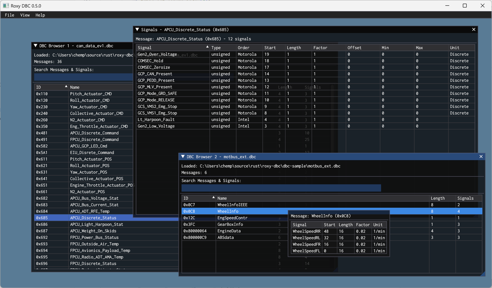

# Roxy DBC

[](https://www.rust-lang.org)
[](LICENSE)

一个现代化的 DBC (Database CAN) 文件查看器，使用 Rust 和 ImGui 构建。

## ✨ 特性

- 🚗 **完整的 DBC 支持** - 解析和显示 CAN 数据库文件
- 📊 **多窗口界面** - 支持同时打开多个 DBC 文件
- 🔍 **智能搜索** - 快速查找消息和信号
- 📋 **表格视图** - 清晰的消息和信号列表显示
- ↕️ **排序功能** - 按任意列对数据进行排序
- 🎨 **现代化UI** - 基于 ImGui 的直观用户界面
- ⚡ **高性能** - 使用 wgpu 进行硬件加速渲染

## 🖼️ 界面预览



### 主要功能
- **消息表格**: 显示消息ID、名称、长度和信号数量
- **信号详情**: 显示选中消息的所有信号信息
- **动态布局**: 消息表和信号表各占窗口一半空间
- **背景高亮**: 选中的消息行会有蓝色背景高亮

## 🛠️ 技术栈

- **语言**: Rust 1.75
- **GUI框架**: ImGui + wgpu
- **窗口管理**: winit
- **DBC解析**: can-dbc
- **文件对话框**: rfd

## 📦 安装

### 前提条件
- Rust 1.75+

### 从源码构建
```bash
# 克隆仓库
git clone https://github.com/chemPolonium/roxy-dbc.git
cd roxy-dbc

# 构建项目
cargo build --release

# 运行
cargo run --release
```

## 🚀 使用方法

### 基本操作
1. **启动应用** - 运行 `cargo run` 或直接执行编译后的程序
2. **打开DBC文件** - 点击 `File -> Load DBC File`
3. **浏览消息** - 在消息表格中查看所有CAN消息
4. **查看信号** - 点击任意消息行查看该消息的信号详情
5. **搜索过滤** - 使用搜索框快速找到特定的消息

### 表格功能
- **排序**: 点击列标题对数据进行升序/降序排列
- **选择**: 点击消息行的任意列都可以选中该消息
- **高亮**: 选中的行会显示蓝色背景
- **动态调整**: 表格高度会根据窗口大小自动调整

### 信号详情
显示的信号信息包括：
- **信号名称**: 信号的标识名
- **起始位**: 信号在消息中的起始位置
- **长度**: 信号的位长度
- **系数**: 信号的比例因子
- **偏移量**: 信号的偏移值
- **最小值**: 信号的最小有效值
- **最大值**: 信号的最大有效值
- **单位**: 信号的物理单位

## 📁 项目结构

```
src/
├── main.rs          # 程序入口点和应用初始化
├── app.rs           # 主应用逻辑和事件处理
├── ui.rs            # UI渲染和界面状态管理
└── dbc.rs           # DBC文件解析和数据结构
```

## 📄 许可证

这个项目基于 GPLv3 许可证开源 - 查看 [LICENSE](LICENSE) 文件了解详情。

## 🙏 致谢

- [can-dbc](https://github.com/marcelbuesing/can-dbc) - DBC 文件解析库
- [ImGui](https://github.com/ocornut/imgui) - 即时模式GUI库
- [wgpu](https://github.com/gfx-rs/wgpu) - 现代图形API
